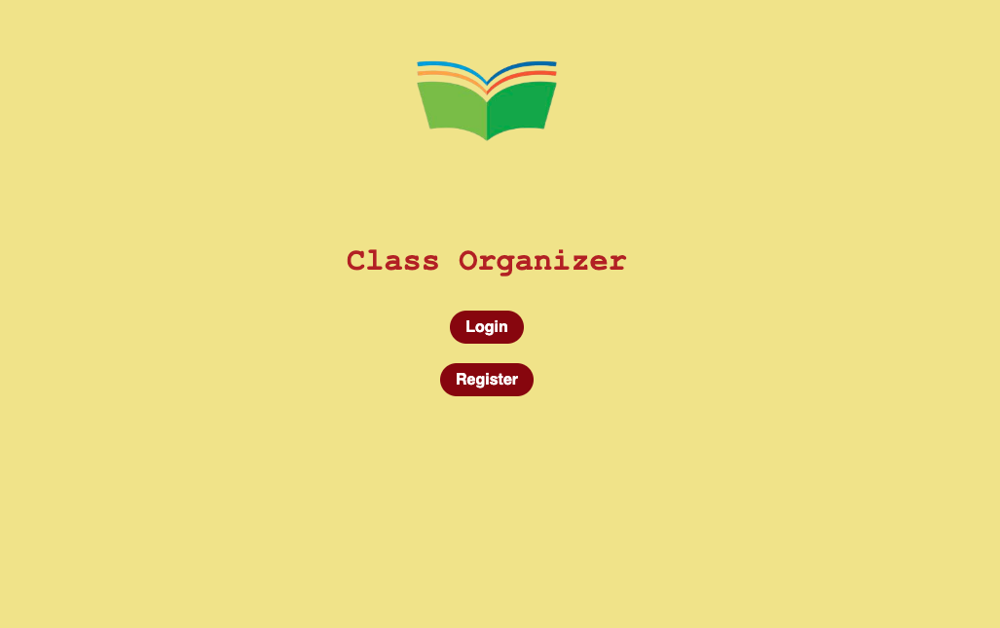
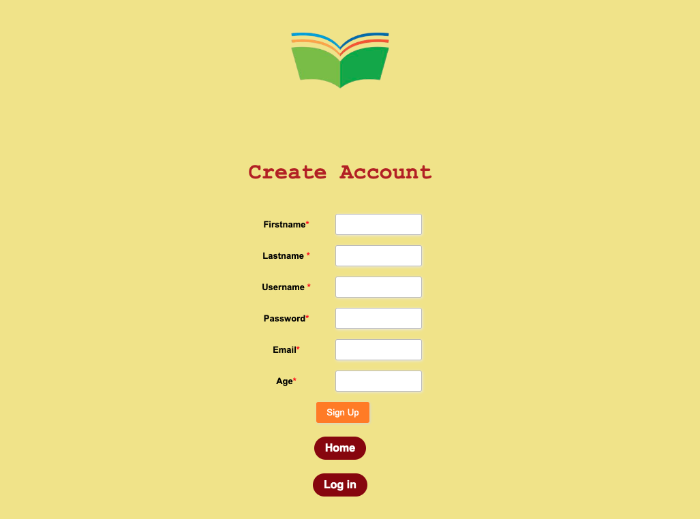
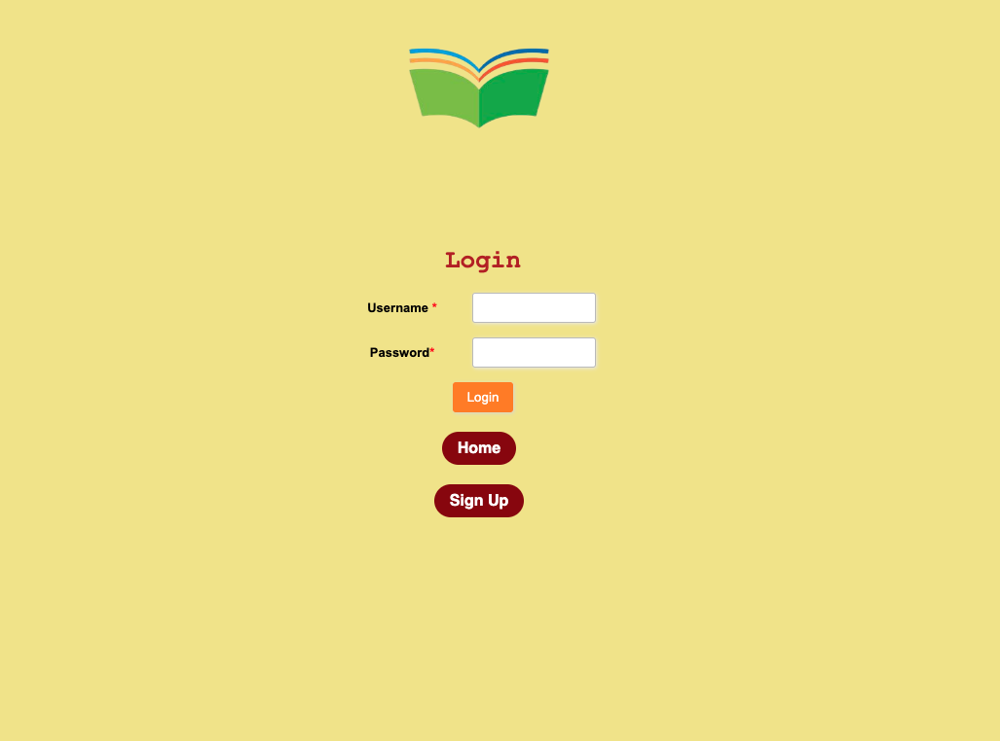
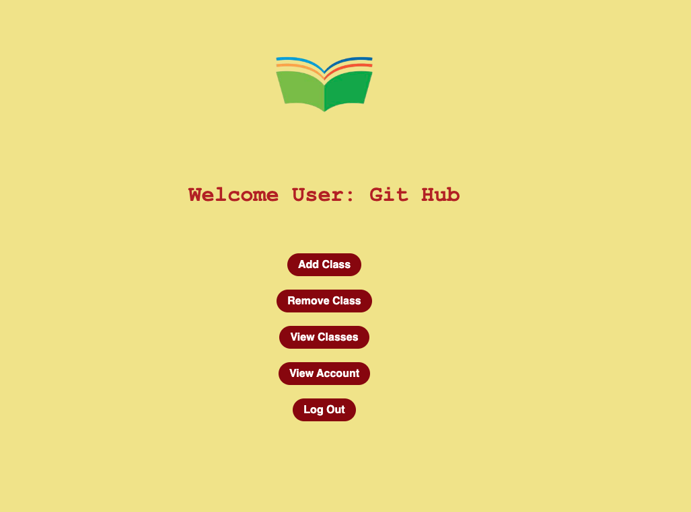
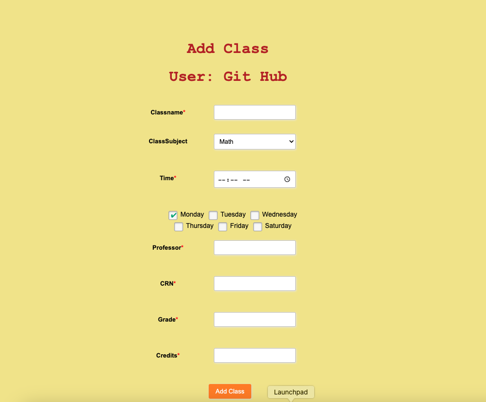
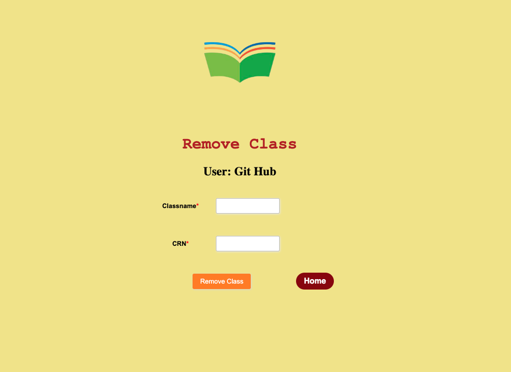
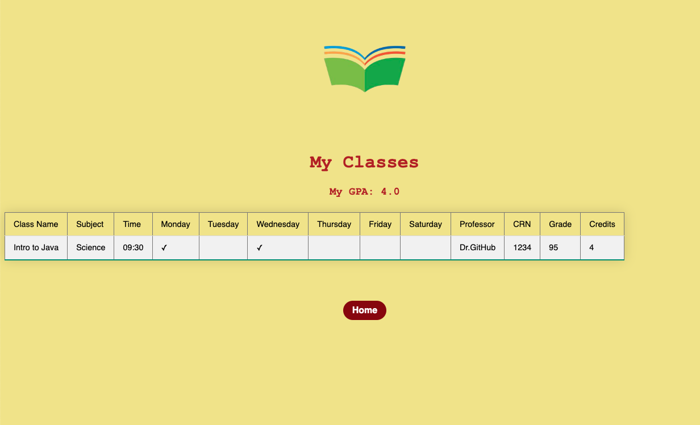
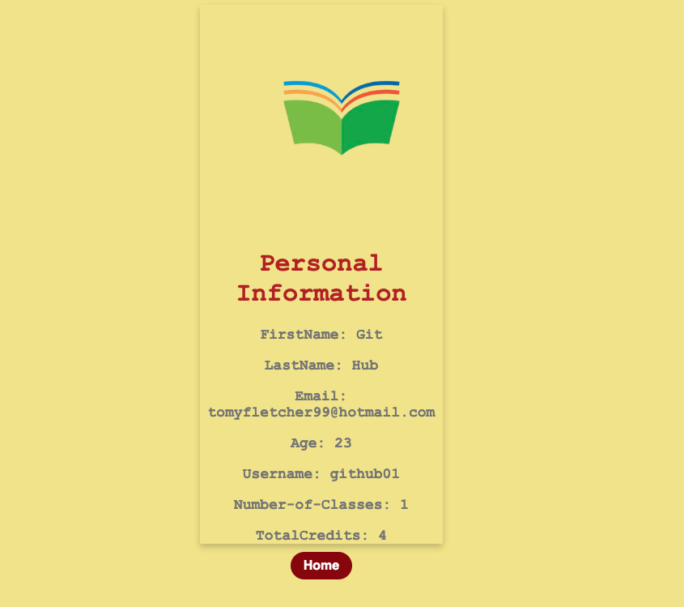

# Hello and Welcome to my First Full stack Project: Class Organizer
## The Problem I wanted to Solve 
For my first web app project I want to fix a common issue amongst my classmates in college. Everytime we signed up for classes we would
receive a class schedule. However, this schedule just had numbers and letters of the day,
and it was not in order or visualized in a matter where you are organized and have a clear understanding of how your days look like. I set out to write a simple program that lets users create an account and proceed to record their class data like how it is in the default schedule and then my program would visualize a schedule that is clearer to understand.

## Running the Program
To get this program up and running you need to have glassfish up and working, along with some start-up connection environment variables for our database url and password etc.

## Deployment
When you build this application you are provided with a war file that can be used to deploy the project.
The way that I deployed this particular project was with Amazon Web Services. I used an EC2 (virtual server)  instance in the same VPC (Virtual Private Cloud) as my RDS (relational database service) therefore my ec2 was in a public subnet while my RDS remained in a private subnet allowing the data to be secure and safe along with implementing security group rules. I was then able to install and run glassfish on my EC2 and deploy my war file to the glassfish portal while calling to my remote database.
The way that I got my war file onto my EC2 instance was by using SSH protocol.

## The Tech
For This project my front end is html, css and jsp. While the backend is Java along with a servlet API for http request and response. My database is mySQL and my server is glassfish 7.0. I took an
object-oriented programming approach

# Design

## Home

## Create Account

## Login

## Landing

## Add Class

## Remove Class

## Schedule

## Account Info

## Contact
Any questions, comments, concerns, email me at 
tomyfletcher99@hotmail.com, hope you guys enjoy. 
